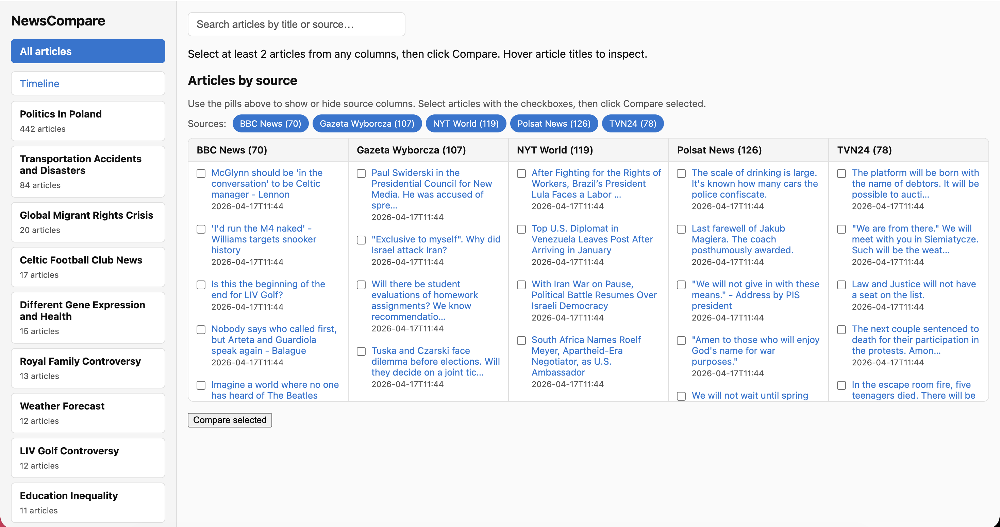

# NewsCompare

Compare news headlines and articles across RSS feeds: see how coverage differs and which claims are agreed, uncorroborated, or in conflict. Optional **GDELT** backfill (free, no API key) adds recent articles by keyword and date. **Export** produces JSON/CSV for offline analysis. No paid subscriptions; local LLMs only (optional, for extraction and comparison).




## Setup

**Poetry (recommended)**

```bash
poetry install
# Optional: claim extraction via Ollama
poetry install --extras llm
# Optional: web UI
poetry install --extras web
# All extras
poetry install --extras llm --extras web
```

**Or venv + pip**

```bash
python3 -m venv .venv
source .venv/bin/activate   # or .venv\Scripts\activate on Windows
pip install -e .
# For claim extraction (Ollama): pip install ollama
# For web UI: pip install fastapi uvicorn jinja2
```

**Config**

```bash
cp config.example.yaml config.yaml
# Edit config.yaml: add your RSS feed URLs and optional LLM/embedding settings.
# For better extraction/labels, use a stronger Ollama model (e.g. qwen2.5:7b).
```

See **[docs/PIPELINE.md](docs/PIPELINE.md)** for how fetch, grouping, topic extraction, and comparison work (and why past articles can seem “lost” until you use the Timeline view). See **[docs/ANALYSIS_PIPELINE.md](docs/ANALYSIS_PIPELINE.md)** for GDELT ingest, batch export, and tuning.

## Usage

- **Fetch** articles from configured feeds (and optionally enrich with full body from article URL):
  ```bash
  poetry run newscompare fetch
  poetry run newscompare fetch --since-days 90   # optional: skip inserts older than N days (by feed date)
  # or: python -m newscompare.cli fetch
  ```

- **Ingest GDELT** (optional backfill by keyword + date range; same SQLite DB, dedupe by URL; ~90-day rolling window per GDELT policy; default no HTML enrich):
  ```bash
  poetry run newscompare ingest-gdelt --query "ukraine" --start 2026-04-01 --end 2026-04-15 --chunk-hours 24 --max-articles 500
  ```

- **Translate** non-English articles to English (helps topics and claims):
  ```bash
  poetry run newscompare translate --hours 168 --limit 500
  ```

- **Compare** (group articles, extract structured story + claims via local LLM if installed, then compare):
  ```bash
  poetry run newscompare compare
  poetry run newscompare compare --hours 48 --json
  poetry run newscompare compare --hours 48 --json -o exports/compare.json
  ```

- **Export** analysis bundle (`stats.json`, `articles.jsonl`, `claims.csv`, `topics.json`):
  ```bash
  poetry run newscompare export --since-days 90 --out-dir exports/my_run
  ```

- **One-shot pipeline** (fetch → translate → topics → export): `./scripts/pipeline_analysis.sh 90`

- **Extract topics** (batch: cluster articles + LLM labels; used by the web UI for topic-based view):
  ```bash
  poetry run newscompare extract-topics --hours 168 --max-topics 25
  ```
  Run after `fetch`. Topics are stored in the DB and shared across all sources so you can compare coverage by topic.

- **Web UI** (if extras installed):
  ```bash
  poetry run newscompare serve --port 8080
  ```
  Open http://127.0.0.1:8080. Progress and logs for comparison (claim extraction, matching) are printed in the **terminal** where `serve` runs. Use `--log-level INFO` (default) to see them; use `--log-level DEBUG` for more detail (e.g. `poetry run newscompare serve --log-level DEBUG`).

  **Topics** tab: auto-generated topics (run `extract-topics` first); click a topic to see a **timeline** (articles by day), **side-by-side by source**, and **claims** (agreed/uncorroborated/conflict). **All articles** tab: select articles and compare manually.

## Local LLM (claim extraction)

For claim extraction the app can use **Ollama** (default in config). Install [Ollama](https://ollama.com), then:

```bash
ollama pull llama3.2:3b
```

Set in `config.yaml` under `llm`:

- `provider: ollama`
- `model: llama3.2:3b`


Run `newscompare compare`; the first run will download the embedding model (sentence-transformers) and may take a moment.

**Extraction (LLM):** Each article can get a short **synopsis**, a structured **incident** block (action, driver, outcome, timeframe, actor, affected, context), and a list of **atomic claims** — stored in SQLite (`story_summary`, `story_incident_json`, `claims`).

**Comparison:** Claims are matched with **sentence-transformers** embeddings. When a structured incident exists, the embedding includes that **situation** so paraphrases align better than raw wording alone. “Same story” gating can use synopsis + incident. **Agreed** = the same fact from at least one *other* `source_id`. **Conflict** = high similarity but contradictory cues (numbers, negation, etc.). Tune **`compare.claim_match_threshold`** in `config.yaml` (often **0.60–0.75**; higher = stricter matching, fewer false “agreed”). Set `LOG_LEVEL=DEBUG` to log similarity stats.

## Fetch logs explained

When you run `newscompare fetch`:

- **RSS feeds** — Fetched first. If you see `Fetched N entries from M feed(s)` with N &gt; 0, feeds are OK.
- **Enrich (full article body)** — For each entry we optionally GET the article URL and extract main text (goose3).
  - **"No content extracted"** — The page is video, paywalled, or JS-heavy; goose3 found no main text. We still store **title + RSS summary**.
  - **"HTTP error … 403 Forbidden"** — The site blocks scrapers (e.g. NYT, some others). We still store **title + RSS summary** from the feed; you get headlines and short descriptions for comparison, just not full body.
  - **"Publish date … could not be resolved to UTC"** — The feed had a relative date (e.g. "7 hours ago"); we keep the article but without a precise time.
- **Result** — Every article is stored. When enrichment fails, body is the feed summary only. Comparison and claim extraction still work on title + whatever body we have.

**What to do:** No action required. In `config.yaml` you can set **`skip_enrich_domains`** (e.g. `nytimes.com`, `wyborcza.pl`) so we never fetch full article body for those hosts — you get titles and feed summaries only, and no 403 / "No content extracted" spam. Use `--no-enrich` to skip enrichment for all feeds.

## Project layout

- `src/newscompare/` — package
  - `config.py` — YAML config
  - `feed_fetcher.py` — RSS/Atom fetch
  - `gdelt_ingest.py` — GDELT DOC 2.0 article list ingest
  - `article_extractor.py` — full-text extraction (goose3)
  - `storage.py` — SQLite
  - `grouping.py` — time + title similarity grouping
  - `llm_dataset.py` — Ollama: synopsis + structured incident + claims
  - `story_schema.py` — incident JSON helpers and embedding text builders
  - `export_bundle.py` — export stats / JSONL / CSV for analysis
  - `embeddings.py` — sentence-transformers
  - `compare.py` — claim matching and agree/uncorroborated/conflict
  - `cli.py` — CLI entrypoint
  - `web/` — FastAPI app and templates
- `scripts/pipeline_analysis.sh` — fetch → translate → extract-topics → export
- `tests/` — pytest
- `docs/PIPELINE.md`, `docs/ANALYSIS_PIPELINE.md`
- `IMPLEMENTATION_GUIDELINES.md` — full spec

## Tests

```bash
poetry run pytest
# or with venv: pytest
```

## License

Use as you like.
